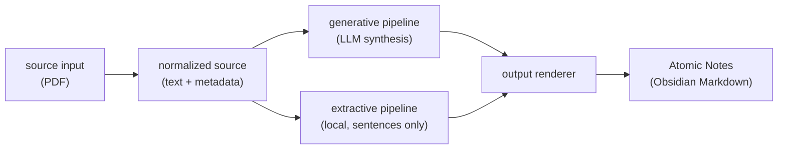

<div align="center">

# atomic-notes

[](https://github.com/TillQuandel/atomic-notes/actions/workflows/ci.yml)
[](https://www.python.org/)
[](#quickstart)
[](LICENSE)
[](https://docs.astral.sh/uv/)
[](https://docs.astral.sh/ruff/)

**PDFs in, verified atomic notes out — every claim footnoted to a source page,
every quality concern shown, and nothing written to your vault until you say so.**

</div>

The implementation starts with PDFs, but the project is input- and
output-independent: source adapters normalize different media into a common source
representation, pipelines create atomic notes, and renderers decide where they go.
PDF input and Obsidian-style Markdown are the first supported path, not the whole
product.



## What makes it different

- **Grounded, not guessed.** Each claim carries a footnote anchored to a source
  page; the source block is rendered from metadata, never free-generated.
- **Honest about doubt.** Confidence ratings and quality-flags (no DOI, duplicate
  risk, unresolved source) are surfaced for review, not hidden.
- **Dry-run first.** Preview every note — routing, critic score, confidence — and
  a diff of anything a re-run would overwrite, before a single file is written.
- **Two pipelines on purpose.** An LLM synthesis path for quality, and a local,
  no-generation extractive baseline for privacy and a low-hallucination yardstick.
  Why they stay separate: [ARCHITECTURE.md](ARCHITECTURE.md).

## Quickstart

This project uses [uv](https://docs.astral.sh/uv/). If you don't have it yet:

```bash
# macOS / Linux
curl -LsSf https://astral.sh/uv/install.sh | sh
# Windows (PowerShell)
powershell -ExecutionPolicy ByPass -c "irm https://astral.sh/uv/install.ps1 | iex"
```

The lockfile then gives a reproducible install on Linux, macOS, and Windows and
pulls a CPU build of `torch` (no multi-gigabyte CUDA wheels):

```bash
git clone https://github.com/TillQuandel/atomic-notes.git
cd atomic-notes
uv sync                       # creates .venv and installs from the lockfile
uv run atomic-notes doctor    # preflight check
uv run atomic-notes run --source examples/zettelkasten-primer.pdf --dry-run
```

> `--dry-run` skips writing to your vault, but still runs the full LLM pipeline and
> uses your backend quota. It is a safe *preview*, not a free one.

Run tools through the environment with `uv run <cmd>`. Plain `pip install -e .`
still works, but `uv` is the supported path. One-shot setup incl. preflight:
`python scripts/setup.py`. Prefer a single command? `python scripts/demo.py`.

<details>
<summary><b>poppler-utils</b> (required for PDF text extraction)</summary>

| Platform | Command |
|----------|---------|
| Ubuntu/Debian | `sudo apt install poppler-utils` |
| macOS | `brew install poppler` |
| Windows | `choco install poppler` or `scoop install poppler` |

</details>

<details>
<summary><b>Configure the LLM backend</b> (no API key by default)</summary>

The default backend drives the **Claude Code CLI** — no API key needed:

```bash
npm install -g @anthropic-ai/claude-code   # or the official install docs
claude auth login                          # sign in once (claude auth status to check)
```

For an API-based backend (Anthropic, OpenAI, Ollama, …) set
`ATOMIC_AGENT_BACKEND=litellm` and add a provider key. See
[generative/README.md](generative/README.md) for full backend documentation.

> **Privacy:** the `litellm` backend sends PDF text to the configured external API.
> For a fully local path, use the `extractive` pipeline or a local `litellm`
> provider such as Ollama. The default `subscription` backend uses your own account.

Point the output at your vault:

```bash
cp generative/.env.example generative/.env
# set ATOMIC_AGENT_VAULT_PATH to your Obsidian vault
```

</details>

<details>
<summary><b>Optional: web GUI</b></summary>

A local web GUI wraps the same pipeline: pick or drag-and-drop a PDF, watch live
per-stage progress, and in dry-run mode preview each note before any write. It runs
the CLI as a subprocess and streams progress over SSE — no React/npm, no telemetry,
fully offline.

```bash
uv sync --extra gui
uv run atomic-notes gui   # http://127.0.0.1:8052
```

</details>

<details>
<summary><b>Which extra do I need?</b></summary>

| Command | Installs | For |
|---------|----------|-----|
| `uv sync` | core | running the generative pipeline + `doctor` |
| `uv sync --extra dev` | + tests/lint stack | development |
| `uv sync --extra gui` | + FastAPI/uvicorn | the web GUI |
| `uv sync --extra extractive` | + GLiNER/torch NLP stack | the local extractive pipeline |

</details>

## Example output

<details>
<summary>A real note from <code>examples/zettelkasten-primer.pdf</code> (abridged)</summary>

Every claim carries a footnote anchored to a source page; the source block is
rendered deterministically from metadata; quality concerns are surfaced as
`quality-flags`. Exact output varies with your vault and the source metadata.

````markdown
---
title: "Atomic Note"
aliases: ["Atomare Note", "atomic note", "Zettelkasten-Grundeinheit"]
type: atomic
synthesis-confidence: low
confidence-rationale: "nicht peer-reviewed (Methodische Limits); nur 1 Anker (Relevance)"
auto-vault-recommended: true
source-file: "zettelkasten-primer.pdf"
quality-flags:
  - "kein DOI — Qualität nicht automatisch prüfbar"
  - "Duplikat-Risiko hoch — prüfe: Atomic Notes"
tags: [zettelkasten, knowledge-management]
related: ["[[Atomic Notes]]", "[[Schema-Konzept]]"]
---
# Atomic Note: Kleinstmögliche eigenständige Wissenseinheit mit genau einer Idee

Eine Atomic Note hält genau eine Idee fest und ist die kleinste Gedankeneinheit,
die noch für sich allein verständlich ist[^1]. ...

> [!quote]- Zettelkasten-Primer 2026, S. 1
> „A note that mixes three ideas is hard to link to anything ..."

[^1]: zettelkasten-primer, S. 1.
````

| Frontmatter field | Meaning |
|-------|---------|
| `synthesis-confidence` | Pipeline's confidence in the synthesis: `high` / `medium` / `low`. |
| `confidence-rationale` | Short reason for a `low`/`medium` confidence. |
| `quality-flags` | Concerns surfaced for review (no DOI, duplicate risk) — not hidden. |
| `source-status` | `unresolved` when author/year could not be confirmed; file left untouched, note flagged. |
| `auto-vault-recommended` | Whether the critic deems the note vault-ready. |
| `pipeline-content-hash` | Checksum so a re-run detects manual edits and avoids overwriting them. |

</details>

## Architecture

The module map, the generative pipeline stages, and the rationale for two pipelines
live in [ARCHITECTURE.md](ARCHITECTURE.md).

```text
generative/   LLM-based synthesis pipeline (CLI + GUI)
extractive/   Local extractive pipeline; source sentences only, no free generation
shared/       Shared schemas, DB schema, cross-pipeline utilities
lib/          decision_engine (aggregation + decision rules)
examples/     Bundled example PDF
```

<details>
<summary><b>Pipelines, output &amp; input direction</b></summary>

### Generative

Synthesizes standalone atomic notes via LLM stages (plan, extract, verify,
cross-reference, critique). The higher-quality path when synthesis is useful.

```bash
uv run atomic-notes run --source <pdf> --dry-run
uv run atomic-notes run --source <pdf>
```

### Extractive

Builds notes from source sentences only — local-first, no free generation. A
privacy-preserving baseline and a low-hallucination comparison path.

```bash
uv sync --extra extractive
uv run python extractive/orchestrator.py --source <pdf> --output obsidian --out-dir ./notes
```

### Output direction

The output contract is a structured atomic note: title, body, source anchors,
source metadata, quality status, optional links/tags. Obsidian Markdown is one
renderer; plain Markdown, JSON, and other PKM formats are renderer concerns.

### Input direction

PDF is the first adapter; future adapters normalize HTML, transcripts, and other
concept-rich sources into the same model. Stage-0 baseline is `pdftotext` (a June
2026 A/B probe found no robust advantage from pdfplumber/GROBID, so they are parked).

</details>

## Status &amp; roadmap

LLM-free unit suite green on ubuntu, windows, and macOS (see CI badge), in a
`uv`-locked Python 3.12 environment. Releases: generative v0.3.x · extractive v0.2.0.

1. **M1 — installable by strangers.** Packaging, entry point, `doctor`, hardened
   backends, CI on all three OSes, reproducible `uv` setup, bundled example. Done.
2. **M2 — trustworthy output.** Gold-standard coverage, threshold calibration, PDF
   text-quality gate + OCR fallback, a small reproducible benchmark.
3. **M3 — staying power.** Configurable note conventions beyond Obsidian, REST/API.

## Development

See [CONTRIBUTING.md](CONTRIBUTING.md) for setup, test commands, the TDD norm, and
ML notes (model caching, slow-test marker).

## License

Apache 2.0
