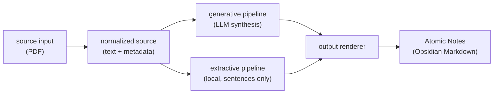

# atomic-notes

[](https://github.com/TillQuandel/atomic-notes/actions/workflows/ci.yml)

**Turn rich sources (starting with PDFs) into verified, atomic, linkable knowledge
notes — every claim anchored to a source page, quality concerns surfaced, not hidden.**

The implementation starts with PDFs, but the project is input- and
output-independent: source adapters normalize different media into a common source
representation, pipelines create atomic notes, and renderers/exporters decide where
those notes go. PDF input and Obsidian-style Markdown are the first supported path,
not the whole product.



Two pipelines on purpose: **generative** synthesizes higher-quality prose with LLM
stages; **extractive** is a local, no-free-generation baseline (privacy + a
low-hallucination comparison path). Why they are kept separate — and the full
module map and stage list — is in [ARCHITECTURE.md](ARCHITECTURE.md).

## Status

**generative v0.3.x** · **extractive v0.2.0**

LLM-free unit suite green on ubuntu + windows (see CI badge), running in a
`uv`-locked environment (Python 3.12). An independent multi-rater assessment
(2026-06-10) and the resulting roadmap live in `internal/docs/` — see
`2026-06-10-projekt-bewertung.md` and `m1-installierbarkeit-plan.md`.

## Quickstart

All commands assume the repository root after cloning — example and `.env` paths
are repo-relative, not part of an installed wheel.

### 1. Install (uv)

This project uses [uv](https://docs.astral.sh/uv/). It reads `uv.lock` for a
reproducible install and pulls the **CPU** build of `torch` (no large CUDA wheels).

```bash
git clone https://github.com/TillQuandel/atomic-notes.git
cd atomic-notes
uv sync                       # creates .venv and installs from the lockfile
# one-shot setup incl. preflight:  python scripts/setup.py
```

Run tools through the environment with `uv run <cmd>` (no manual venv activation
needed). Plain `pip install -e .` still works, but `uv` is the supported path.

**poppler-utils** (required for PDF text extraction via `pdftotext`):

| Platform | Command |
|----------|---------|
| Ubuntu/Debian | `sudo apt install poppler-utils` |
| macOS | `brew install poppler` |
| Windows | `choco install poppler` or `scoop install poppler` |

### 2. Configure backend

The default backend drives the **Claude Code CLI** — no API key needed. Install
the CLI and log in once:

```bash
npm install -g @anthropic-ai/claude-code   # or follow the official install docs
claude login
```

For an API-based backend (Anthropic, OpenAI, Ollama, …) set
`ATOMIC_AGENT_BACKEND=litellm` and add a provider key. See
`generative/README.md` for full backend documentation.

> **Privacy:** the `litellm` backend sends PDF text to the configured external API
> (e.g. Anthropic/OpenAI). For a fully local path that never leaves your machine,
> use the `extractive` pipeline (see Pipelines below) or a local `litellm` provider
> such as Ollama. The default `subscription` backend uses your own Claude account.

Copy the example env file and fill in your paths:

```bash
cp generative/.env.example generative/.env
# edit generative/.env: set ATOMIC_AGENT_VAULT_PATH to your Obsidian vault
```

Generated notes land in the Obsidian vault directory configured via
`ATOMIC_AGENT_VAULT_PATH` in `generative/.env`.

### 3. Preflight check

```bash
uv run atomic-notes doctor
```

### 4. Run on the bundled example

**Start with `--dry-run`.** It shows what would be generated — including a slim
Markdown diff of any note that a re-run would overwrite — without writing or
changing a single file. Once the preview looks right, drop the flag for the real
run.

```bash
# recommended first run — preview only, writes nothing
uv run atomic-notes run --source examples/zettelkasten-primer.pdf --dry-run

# full run — writes atomic notes to your configured vault
uv run atomic-notes run --source examples/zettelkasten-primer.pdf
```

Prefer a one-liner? `python scripts/demo.py` runs the bundled example end to end.

### 5. Optional: web GUI

A local web GUI wraps the same pipeline: pick a configured PDF or drag-and-drop
(or upload) any PDF, watch live per-stage progress, and in dry-run mode preview
each generated note (routing, critic score, confidence) before any write. It runs
the CLI as a subprocess and streams progress over SSE — no React/npm, no telemetry,
fully offline.

```bash
uv sync --extra gui       # FastAPI + uvicorn + python-multipart
uv run atomic-notes gui   # opens http://127.0.0.1:8052
```

It stands beside the read-only eval dashboard, not replacing it.

## Example output

Below is a real note the generative pipeline produced from the bundled
`examples/zettelkasten-primer.pdf`. Every claim carries a footnote anchored to a
source page, the source block is rendered deterministically from metadata (not
free-generated), and quality concerns are surfaced as `quality-flags` rather than
hidden. Exact output varies with the notes already in your vault and the metadata
the source exposes.

````markdown
---
title: "Atomic Note"
aliases:
  - "Atomare Note"
  - "atomic note"
  - "Zettelkasten-Grundeinheit"
type: atomic
synthesis-confidence: low
confidence-rationale: "nicht peer-reviewed (Methodische Limits); nur 1 Anker (Relevance)"
auto-vault-recommended: true
source-file: "zettelkasten-primer.pdf"
claude-generated: true
quality-flags:
  - "⚠️ kein DOI — Qualität nicht automatisch prüfbar"
  - "⚠️ Duplikat-Risiko hoch — prüfe: Atomic Notes"
created: 2026-06-17
tags:
  - zettelkasten
  - knowledge-management
related:
  - "[[Atomic Notes]]"
  - "[[Schema-Konzept]]"
---
# Atomic Note: Kleinstmögliche eigenständige Wissenseinheit mit genau einer Idee

Eine Atomic Note hält genau eine Idee fest und ist die kleinste Gedankeneinheit, die noch für sich allein verständlich ist[^1]. Der Begriff ist der Chemie entlehnt: wie ein Atom die kleinste Einheit mit den Eigenschaften eines Elements ist, ist eine Atomic Note die kleinste Informationseinheit, die noch ohne äußeren Kontext bedeutsam bleibt[^2].

Die Beschränkung auf eine Idee pro Note ist keine Einschränkung, sondern eine Design-Entscheidung[^4]. Wenn jede Note einen einzigen kohärenten Gedanken trägt, wird Retrieval (Wiederfinden) präzise und Rekombination möglich[^5].

> [!quote]- Zettelkasten-Primer 2026, S. 1
> „A note that mixes three ideas is hard to link to anything because it is always half-relevant."

[^1]: zettelkasten-primer, S. 1.
[^2]: zettelkasten-primer, S. 1.
[^4]: zettelkasten-primer, S. 1.
[^5]: zettelkasten-primer, S. 1.

## Quellen

*Quelle: zettelkasten-primer 2026: zettelkasten-primer, S. 1*
````

The body above is abridged for the README; a full run emits the complete note
(all paragraphs and page anchors) to your configured vault.

### Frontmatter fields

| Field | Meaning |
|-------|---------|
| `type` | Note kind (`atomic`, `merge-stub`, …). |
| `synthesis-confidence` | Pipeline's confidence in the synthesis: `high` / `medium` / `low`. |
| `confidence-rationale` | Short reason for a `low`/`medium` confidence (only when set). |
| `quality-flags` | Concerns surfaced for review (e.g. no DOI, duplicate risk) — not hidden. |
| `source-file` | The source PDF the note was generated from. |
| `source-status` | `unresolved` when the source identity (author/year) could not be confirmed — e.g. enrichment found none or a weak CrossRef match was rejected; the file is left untouched and the note flagged for review. |
| `auto-vault-recommended` | Whether the critic deems the note vault-ready; routing itself is tag-based via Auto Note Mover. |
| `pipeline-content-hash` | Checksum of the generated note — lets a re-run detect manual edits and avoid overwriting them. |

## Roadmap

1. **M1 — installable by strangers**: packaging, entry point, preflight `doctor`,
   hardened backend error paths, CI on ubuntu + windows, quickstart walkthrough,
   reproducible `uv` setup, and bundled example are all done. M1 complete.
   Plan: `internal/docs/m1-installierbarkeit-plan.md`.
2. **M2 — trustworthy output**: gold-standard coverage measurement, threshold
   calibration, PDF text-quality gate + OCR fallback, a small reproducible benchmark.
3. **M3 — staying power**: configurable note conventions beyond Obsidian, REST/API
   layer (issues #9–#11).

## Architecture

See [ARCHITECTURE.md](ARCHITECTURE.md) for the module map, the generative pipeline
stages, and the rationale for keeping the two pipelines separate. Repository layout
in brief:

```text
generative/   LLM-based synthesis pipeline (CLI + GUI)
extractive/   Local extractive pipeline; source sentences only, no free generation
shared/       Shared schemas, DB schema, cross-pipeline utilities
lib/          decision_engine (aggregation + decision rules)
internal/     Evaluation dashboard + development notes (not user-facing)
examples/     Bundled example PDF
```

## Pipelines

### Generative

The generative pipeline synthesizes standalone atomic notes from source material.
It uses LLM stages for planning, extraction, verification, cross-reference checks,
and critique. This is the higher-quality path when synthesis is useful and
API/model access is acceptable.

No API key is required: the default backend drives the Claude Code CLI, so a Claude
Pro/Max subscription plus a logged-in CLI is enough. An API-based backend (litellm:
Anthropic, OpenAI, Ollama, …) is available via `ATOMIC_AGENT_BACKEND=litellm`. See
`generative/README.md` for details and limits.

```bash
uv run atomic-notes doctor
uv run atomic-notes run --source <pdf> --dry-run
uv run atomic-notes run --source <pdf>
```

### Extractive

The extractive pipeline builds notes from source sentences. It is local-first and
does not freely generate prose, so it is useful as a privacy-preserving baseline
and as a low-hallucination comparison path. Install its dependencies via the
`extractive` extra:

```bash
uv sync --extra extractive
uv run python extractive/orchestrator.py --source <pdf> --output obsidian --out-dir ./notes
uv run python extractive/orchestrator.py --source <pdf> --output json --out-dir ./notes
```

## Output Direction

The long-term output contract is a structured atomic note: title, body, source
anchors, source metadata, quality status, and optional links/tags. Obsidian
Markdown is one renderer. Plain Markdown, JSON, ZIP exports, and other PKM formats
should be renderer concerns rather than pipeline assumptions.

## Input Direction

PDF is the first adapter. Future adapters should normalize HTML/articles, RSS
items, transcripts, podcasts, videos, and other concept-rich sources into the same
source model before the pipeline runs.

Current Stage-0 baseline is `pdftotext`. A June 2026 A/B probe evaluated pdfplumber
and GROBID but did not show a robust advantage over `pdftotext`; pdfplumber also
regressed on a two-column PDF through glued words and lower word yield. The
pdfplumber adapter is therefore parked until a focused comparison shows a yield or
grounding gain over `pdftotext` beyond run noise.

## Development

See [CONTRIBUTING.md](CONTRIBUTING.md) for the dev setup, test commands, the TDD
norm, and ML-specific notes (model caching, slow-test marker). New code and public
documentation should use `generative` (LLM synthesis), `extractive` (local
sentence extraction), and `internal` (dashboards, calibration, dev-only tooling).

## License

Apache 2.0
