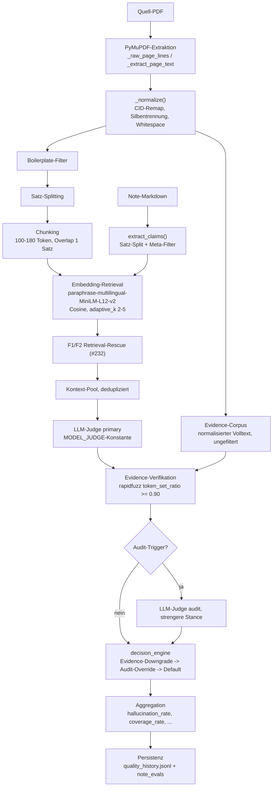

# Evaluation (EVAL_VERSION 4.3)

**Stand:** master `64d889554c7de4e253f483457536f78efc75756b` (`fix(dashboard): pdf_key-Drift-Varianten in _pdf_group_key kanonisieren (#311)`), 2026-07-16. Alle Datei:Zeile-Anker unten beziehen sich auf diesen Commit — bei künftigen Änderungen an den zitierten Dateien können Zeilennummern driften.

**Zielgruppe:** Till (Betreiber) und künftige Sessions, die Eval-Messwerte interpretieren oder die Eval-Pipeline ändern. Kein Nutzer-Dokument (siehe [README.md](../README.md)/[generative/README.md](../generative/README.md) dafür).

**Scope:** Nur die **generative** Faithfulness-Eval (`generative/eval_quality_v4.py`). Die extraktive Pipeline hat eine eigene, separate Messung (`extractive/eval/extractive_eval.py`, schreibt in dieselben `note_evals`/`pipeline_runs`-Tabellen, aber ohne LLM-Judge) — hier nicht behandelt.

Markierung `[ungeprüft]` = im Code nicht direkt belegt, sondern aus Kontext erschlossen oder mündlich/aus Session-Notizen bekannt. Alles andere trägt einen `datei.py:zeile`-Anker.

## Kurzübersicht

| Frage | Antwort | Kapitel |
|---|---|---|
| Wie kommt man vom PDF zur Zahl? | PyMuPDF → `_normalize` → Chunking/Claims → Embedding-Retrieval → LLM-Judge → Evidence-Fuzzy-Check → Audit → decision_engine → Aggregation | [1](#1-überblick--datenfluss) |
| Was zählt als Halluzination? | `not_in_context` + `contradicted`, Nenner = `valid_claims` (ohne Parse-Error/Retrieval-Uncertain) | [2](#2-metrik-definitionen) |
| `coverage_rate` vs. `coverage_factual`? | `coverage_rate` = `confirmed_rate` (aktive Metrik). `coverage_factual` ist eine 2026 abgeschaffte v1.3-Metrik, seit v4 **immer NULL** | [2](#2-metrik-definitionen) |
| Was bedeutet `-1.0`? | Sentinel für „nicht messbar" (0 valide Claims / Fehler) — nie 0 % | [2](#2-metrik-definitionen) |
| Was invalidiert den Eval-Cache? | Ein `EVAL_VERSION`-Bump (aktuell 4.3) | [3](#3-versionierung--cache) |
| Wo landen die Werte? | `generative/.cache/quality_history.jsonl` (append-only) + `note_evals`/`pipeline_runs` in `atomic_analytics.db` | [4](#4-persistenz) |
| Was NICHT vergessen beim Lesen der Zahlen? | Selektions-Bias, Re-Eval-Zeilen tragen den Eval-Code-Stand nicht die Erzeugungsversion, PDF-Mix-Artefakte bei gepoolten Deltas | [5](#5-bekannte-grenzen--offene-issues), [6](#6-interpretations-leitfaden) |

## 1. Überblick & Datenfluss

### PDF-Text-Extraktion (PyMuPDF)

Die Eval öffnet die Quell-PDF **unabhängig** von der Generierungs-Pipeline (die `pdftotext`/poppler nutzt, `generative/pipeline/pdf_chunker.py:145` `pdf_to_pages`) noch einmal selbst, über `fitz` (PyMuPDF). Zwei Extraktionswege, für zwei Zwecke:

- **`_raw_page_lines`** (`generative/eval_common.py:292-306`) → über `_filter_boilerplate_pages` (`eval_common.py:317-337`, entfernt wiederkehrende Kurzzeilen wie Running-Header, Abbildungs-/Tabellen-Captions und einen erkannten Literaturverzeichnis-Block) → `_pdf_sentences` (`eval_common.py:340-359`) liefert die (Satz, Seite)-Paare, aus denen `_chunks_from_sentences` (`eval_common.py:367-391`) die Chunks baut, die der Judge als Kontext sieht. Fällt nur zurück auf `_extract_page_text` (`eval_common.py:28-43`), falls `_raw_page_lines` für **jede** Seite leer bleibt (`eval_common.py:347-348`).
- **`_extract_page_text`** (`eval_common.py:28-43`, `page.get_text("blocks")`, nach Y-Position sortiert) baut zusätzlich, **ohne** den Boilerplate-Filter, den `full_text` für den Evidence-Corpus (`eval_quality_v4.py:265`, `_verification_text`/`_normalize_for_evidence`). Konsequenz: der Text, gegen den Zitate fuzzy verifiziert werden, ist ungefilterter als der Text, den der Judge als Chunks sieht (Running-Header/Bibliographie bleiben im Evidence-Corpus enthalten) — verschärft die unter [#307](#5-bekannte-grenzen--offene-issues) beschriebene Rekombinations-Masking-Fläche geringfügig, nicht separat gemessen [ungeprüft, Ausmaß].

Seitenzahlen laufen im **PageLabel-Namespace** (`anchor_page_numbers`, `generative/pipeline/pdf_chunker.py:123-135`) — dieselbe Druckseiten-Zählung wie die Fußnoten-Anker der Note, nicht der physische PDF-Index.

Beide Wege laufen durch **dieselbe** `_normalize()` (`eval_common.py:46-77`): Silbentrennung am Zeilenende, Whitespace-Kollaps, Anführungszeichen-Normalisierung — und seit #298 (EVAL_VERSION 4.3) ein **CID-Font-Rückmapping** (`eval_common.py:55-70`): manche eingebettete Schriftarten mappen ihr Leerzeichen-Glyph auf U+0231 („ȱ") bzw. ihren Trennstrich auf U+022C („Ȭ") statt auf ASCII — am Original-PDF „Jockisch – 2010 – Das Technologieakzeptanzmodell.pdf" per PyMuPDF nachgemessen: U+0231 5173×, U+022C 240×. Ohne Rückmapping liest der Judge nur noch zusammengeschriebene Wörter und scheitert an einer Quelle, die die Notiz korrekt zitiert hat (0 % Coverage, 43–57 % „Halluzination" — reines Artefakt, PR #298).

**CID-Verdachts-Warnung (#306, generisch, additiv):** `_normalize()` fixt nur die zwei bekannten Jockisch-Codepoints — jedes andere PDF mit einem anderen CID-Fehlmapping bleibt unrepariert und würde dasselbe Fehlerbild erzeugen. `generative/eval_text_quality.py::detect_cid_suspect()` scannt den per `_extract_page_text` gewonnenen `full_text` (nach `_normalize`, also nach dem #298-Fix) auf ein verdächtiges Nicht-ASCII-Häufigkeitsprofil: dominiert ein **einzelner** Codepoint außerhalb von ASCII/Latin-1 Supplement/Latin Extended-A (abzüglich einer Whitelist gängiger typografischer Satzzeichen wie Gedankenstrich/„smarte" Anführungszeichen) mit ≥ 0,5 % aller Zeichen, gilt das als CID-Verdacht — genau das Muster, das U+0231 im Jockisch-PDF zeigte. Bei Treffer: additives Feld `result["pdf_text_suspect_cid"]` (`{codepoint, count, ratio, total_chars}`, sonst `None`) plus `"cid_font_suspect"` in `result["quality_flags"]`, berechnet einmal pro PDF in `_pdf_artifacts()` (`eval_quality_v4.py`) und dort auch prominent auf stderr geloggt. **Kein** Rückmapping, **keine** Label-/Raten-Änderung — reine Diagnostik, deshalb kein EVAL_VERSION-Bump nötig.

### Claim-Extraktion aus der Note

`extract_claims()` (`eval_common.py:259-280`): liest den Note-Body ohne Frontmatter/Überschriften-Marker (`_read_note_body`, `eval_common.py:122-136`), entfernt Blockquote-Callouts und Fußnoten-Marker, splittet in Sätze (`_split_sentences`, `eval_common.py:195-198`, mit Abkürzungs-/Seitenzahl-Schutz `_protect_sentence_periods`, `eval_common.py:184-192`) und filtert Nicht-Claims (`filter_meta_claims`, `eval_common.py:236-256`: reine Wiki-Link-Pointer, Merge-Stub-Marker, reine Zitat-Fragmente).

**Bekannter malformed-Claim-Fall:** die regexbasierte Satzgrenzen-Erkennung kennt nicht jedes Zitierschema. Empirischer Fund (Note „Dokumentenanalyse (empirische Methode).md", eval_version 4.3, aus `generative/.cache/quality_history.jsonl`, lokal/nicht Teil des Git-Repos): der extrahierte Claim `"Schmidt 2017, Döring/Bortz 2016, Hoffmann 2018)."` ist ein abgerissenes Fragment einer Aufzählung, keine echte Aussage — der Judge bewertete es dennoch (`top_cosine` 0.482, Audit stufte es auf `not_in_context` herunter). Kein Einzelfall-Fix vorgesehen, aber ein bekanntes Rauschen in den Claim-Zahlen.

### Embedding-Retrieval

Modell: `paraphrase-multilingual-MiniLM-L12-v2` (sentence-transformers, lokal, `generative/embeddings.py:3,20`) — dasselbe Modell, das auch die Entity-Resolution der Pipeline nutzt. `_retrieve_claim_contexts` (`eval_quality_v4.py:424-509`) rankt Chunks nach Cosine gegen den Claim; **adaptive_k** (`eval_quality_v4.py:456-468`) hält alle Chunks innerhalb von 0.05 Cosine-Abstand zum Top-Treffer (dichtes Cluster → größeres k, harter Abfall → k=2), gedeckelt auf `TOP_K=5` (`eval_common.py:100`).

Seit #232 (EVAL_VERSION 4.2) zusätzlich **F1/F2-Retrieval-Rescue** (`eval_quality_v4.py:120-421`), weil das Chunk-Ranking den tatsächlich stützenden Satz oft verfehlt (Chunk-Score wird über 100–180 Token gemittelt):

- **F1 Satz-Level-Rescue** (`_rescue_chunk_indices`, `eval_quality_v4.py:375-421`): injiziert additiv (kein Relabel) die Home-Chunks der best-belegenden Sätze — semantischer Pfad (Satz-Cosine ≥ `RESCUE_SENTENCE_MIN_COSINE=0.45`, `eval_quality_v4.py:163`) und lexikalischer Pfad (Content-Token-Overlap ≥ `RESCUE_LEXICAL_MIN_OVERLAP=2`, `eval_quality_v4.py:165`), Round-Robin verschränkt, gedeckelt auf `min(RESCUE_MAX_CHUNKS=6, round(0.30·n_chunks))` (`_rescue_budget`, `eval_quality_v4.py:367-372`).
- **F2 Titel-Chunk-Dämpfung** (`_looks_like_front_matter`, `eval_quality_v4.py:194-202`): dämpft den ersten Chunk im Ranking um `RESCUE_TITLE_CHUNK_PENALTY=0.08`, wenn er wie Titelseite/Running-Header aussieht.
- **Ausdrücklich dokumentiertes Masking-Risiko** (`eval_quality_v4.py:141-157`, `generative/calibration/retrieval-goldset/README.md:55-83`): der Off-Topic-Floor (0.45 Cosine) trennt themen-nahe Halluzinationen nicht von echten Cross-Lingual-Belegen — beide liegen in derselben Cosine-Range (0.64–0.67). Der Recall-Fix ist an einem deterministischen Goldset getestet, **ob die aggregierte Rate dadurch großflächig zu gutmütig wird, ist nicht mit echtem Judge gemessen** (nur das Budget-Cap begrenzt die Fläche).

Separat und flag-only (kein Masking, da kein Kontext injiziert): `apply_source_presence_fallback` (`eval_quality_v4.py:308-329`) markiert `not_in_context`-Claims mit hoher Volltext-Präsenz (`SOURCE_PRESENCE_COSINE=0.75`, ENV-tunbar) als `possible_retrieval_miss` — reine Sichtbarkeit, ändert kein Label.

### LLM-Judge

Prompt-Aufbau: `_prompt_header`/`_build_prompt` (`eval_quality_v4.py:512-626`). Der Judge sieht **nur** den Note-Titel (nicht den Note-Body — bewusst, gegen Confirmation-Bias, Kommentar `eval_quality_v4.py:517-519`) plus einen deduplizierten Kontext-Pool (`_build_context_pool`, `eval_quality_v4.py:556-579`, K1/K2/…-IDs, spart 40–60 % Prompt-Tokens bei Chunk-Overlap). Fünf Labels zur Wahl (`eval_quality_v4.py:530-535`, `lib/decision_engine/models.py:16-20`):

| Label | Bedeutung |
|---|---|
| `supported_exact` | wörtlich/fast wörtlich (≥80 % lexikalische Überlappung) |
| `supported_paraphrase` | Sinn vorhanden, andere Wortwahl |
| `partially_supported` | Teilaspekt belegt, Rest Synthese |
| `not_in_context` | im gelieferten Kontext nicht belegt |
| `contradicted` | Quelle widerspricht explizit |

Dazu zwei **System-Labels**, die kein Judge-Urteil sind (`lib/decision_engine/models.py:21-25`): `retrieval_or_parse_uncertain` (Cosine des Top-Treffers < `RETRIEVAL_LOW_COSINE=0.4`, terminale System-Regel, `lib/decision_engine/rules.py:62-69`) und `parse_error` (Judge-Output nicht parsebar, terminale Regel `rules.py:55-59`, mit einem Claude-Reparatur-Call als Rettungsversuch, `_repair_json_with_claude`, `eval_quality_v4.py:643-663`).

**Modell:** `MODEL_JUDGE`-Konstante (`generative/config.py`, Env `ATOMIC_AGENT_MODEL_JUDGE`) — Default ist `MODEL_MAIN` (Env `ATOMIC_AGENT_MODEL_MAIN`), welches wiederum auf **`anthropic/claude-sonnet-4-6`** defaultet, nicht Opus. Historisch: A/B-Test 2026-05-20 fand niedrigere Halluzinationsrate + 3× günstiger bei gleicher Note-Anzahl gegenüber Opus (`config.py`). Vor #317 hieß der Hauptslot irreführend `MODEL_OPUS` und der Judge-Call hing fest an dieser Konstante — seit #317 hat der Judge einen eigenen, unabhängig überschreibbaren Slot (`ATOMIC_AGENT_MODEL_JUDGE`, unabhängig von Planner/Extractor/Extender/Canonicalizer wählbar), und `MODEL_OPUS`/`ATOMIC_AGENT_MODEL_OPUS` existieren nur noch als deprecated Alias auf `MODEL_MAIN` für Rückwärtskompatibilität.

**Verifikation, wo der Judge-Modellstring landet (#317):** das im Eval-Ergebnis gespeicherte `model_config`-Feld (`eval_quality_v4.py:1045`, Snapshot von `MODEL_CONFIG`, `config.py`) hat weiterhin **keinen** eigenen `judge`-Eintrag — der Judge-Call ist dort nicht sichtbar (unverändert durch #317, bewusst keine Schemaänderung an `quality_history.jsonl`). Der tatsächlich verwendete Modellstring wird aber unabhängig davon korrekt aufgezeichnet: jeder LLM-Call (inkl. Judge- und JSON-Reparatur-Call, die explizit `model=MODEL_JUDGE` übergeben) schreibt sein reales, aufgelöstes Modell in die Call-Trace (`.cache/runs/<run-id>.jsonl`, Feld `"model"`, `generative/agents/base.py::_trace`) — der irreführende Konstantenname landete dort also nie, nur der echte String.

### Evidence-Fuzzy-Verifikation

`_verify_evidence_normalized` (`eval_quality_v4.py:800-809`): `rapidfuzz.fuzz.token_set_ratio(evidence, corpus) / 100.0`, Schwelle **0.90** (`eval_quality_v4.py:809`). `corpus` ist der normalisierte **Gesamt-Volltext** der PDF (`_normalize_for_evidence`, `eval_quality_v4.py:774-793`, einmal pro PDF gecacht: `_evidence_corpus`, `eval_quality_v4.py:288-298`), nicht nur der retrievte Chunk. `_normalize_for_evidence` entfernt zusätzlich freistehende 1–3-stellige Zahl-Tokens (PyMuPDF interleavt hochgestellte Fußnotenmarker als Inline-Ziffern) — symmetrisch auf Zitat und Corpus angewandt.

### Audit-Override

Zwei unabhängige Trigger für einen zweiten, strengeren Judge-Pass (`_audit_indices`, `eval_quality_v4.py:812-837`): `top_cosine < 0.4` **oder** `evidence_unverified` im Claim, plus ein deterministisches, hash-stabiles 2-%-Sample **pro Label-Bucket** (`math.ceil(len(rows) * 0.02)`, `eval_quality_v4.py:829`, Hash über `note_title|claim` statt Zufall — reproduzierbar über wiederholte Läufe). Der Audit-Judge bekommt dieselben Claims mit einer skeptischeren Prompt-Variante (`eval_quality_v4.py:513-514`: „Bevorzuge strenge Labels bei Retrieval-Problemen").

Override-Logik in `decision_engine` (3 Phasen, `lib/decision_engine/pipeline.py:33-66`): (1) Terminal-System-Regeln (`parse_error`, `low_cosine`) laufen zuerst und sind endgültig; (2) Evidence-Downgrade (`apply_evidence_downgrade`, `lib/decision_engine/rules.py:77-95`) mutiert `supported_exact → not_in_context` bzw. `supported_paraphrase → partially_supported`, wenn die Evidence-Fuzzy-Verifikation fehlschlägt; (3) **Audit überschreibt den (ggf. schon downgegradeten) Primary-Judge nur, wenn das Audit-Label strenger ist** (`STRICTNESS_RANK`, `lib/decision_engine/models.py:30-36`: exact < paraphrase < partial < not_in_context < contradicted), sonst gewinnt der Primary-Judge (`rule_audit_stricter_override`, `lib/decision_engine/rules.py:103-116`).

Der Fall **`supported_exact → not_in_context`** existiert real, auf beiden Wegen: als Evidence-Downgrade (`source="downgrade"`) und als echter Audit-Override (`source="audit_override"`). Empirischer Beleg aus `quality_history.jsonl` (3 Treffer mit `decision_source="audit_override"`, `label_original="supported_exact"`, `label="not_in_context"`), z. B. Note „Three Types of Communication in E-Learning.md" (eval_version 4.1): Primary-Judge urteilte `supported_exact` (Evidence fuzzy-verifiziert), der Audit-Judge stufte auf `not_in_context` herunter (`quality_flags: judge_uneinig, audit_overridden`, `top_cosine` 0.627) — der wörtliche Fund im Kontext trug den Claim inhaltlich nicht ausreichend, obwohl Textbausteine übereinstimmten.

## 2. Metrik-Definitionen

Alle Metriken werden **pro Note** in `_aggregate()` (`eval_quality_v4.py:946-1049`) aus den `decision_engine`-Ergebnissen (`lib/decision_engine/aggregation.py:76-128`) gebaut. `valid_claims` = alle Claims außer den System-Labels `parse_error`/`retrieval_or_parse_uncertain` (`SYSTEM_LABELS`, `lib/decision_engine/models.py:25`; `_valid()`, `aggregation.py:16-17`).

| Metrik | Formel | Nenner | Anker |
|---|---|---|---|
| `hallucination_rate` | (`not_in_context` + `contradicted`) / `valid_claims` | `valid_claims` (note-level) | `aggregation.py:27-31`, `eval_quality_v4.py:993-995` |
| `coverage_rate` | **identisch zu `confirmed_rate`**: (`supported_exact` + `supported_paraphrase`) / `valid_claims` | `valid_claims` | `aggregation.py:34-38`, `eval_quality_v4.py:997-998,1034` |
| `coverage_factual` | abgeschaffte v1.3-Metrik (satzbasiert) — **kein Code-Pfad ab v4 setzt diesen Key noch**, Feld existiert nur in der DB-Spalte für historische 1.3-Zeilen | — | `shared/db_schema.py:54-59`, Issue #233 |
| `claim_support_rate` | (`supported_exact`+`supported_paraphrase`+`partially_supported`) / `valid_claims` | `valid_claims` | `aggregation.py:96`, `eval_quality_v4.py:999-1000` |
| `citation_verification_rate` | verifizierte Evidence / Claims mit Evidence | Claims mit Evidence | `eval_quality_v4.py:1027` |
| `retrieval_failure_rate` / `uncertain_rate` | `retrieval_or_parse_uncertain` / **alle** Claims (nicht `valid_claims` — System-Metrik) | `claims_total` | `aggregation.py:48-56` |

### `hallucination_rate`: ankergewichtet vs. note-level

Der **note-level** Wert oben ist, was in `quality_history.jsonl`/`note_evals` pro Zeile steht. Das Dashboard aggregiert für KPI-Kacheln/Sparklines zusätzlich **ankergewichtet über mehrere Notes** (`_pooled_hall_stats`, `generative/eval_dashboard.py:191-240`): Σ`anchors_hallucinated` / Σ`anchors_total` statt Median/Mean der Pro-Note-Raten — bewusst, weil der Median bei Zero-Inflation auf 0 kollabiert und ein Mean-of-rates kleine Notes überbewertet. Wilson-95-%-CI (`wilson_ci`, `eval_common.py:85-93`) wird für **beide** Ebenen aus derselben Funktion gebaut: pro Note (`eval_quality_v4.py:996`) und gepoolt (`eval_dashboard.py:223`).

### `-1.0`-Sentinel

Geschrieben, wenn eine Rate nicht messbar ist — **nie** als 0 %/0.0 zu lesen. Bedingung (`eval_quality_v4.py:994`, `997-998`): `error is not None` (z. B. `too_many_parse_errors`, `no_valid_claims`, `note_not_found`) **oder** `valid_claims == 0`. `hallucination_rate` und `coverage_rate` sind dabei **strukturell gekoppelt** — beide hängen an derselben `valid_claims`-Bedingung und sind bei ungültigem Lauf immer gemeinsam `-1.0`.

Empirisch (DB-Kopie `C:/tmp/sweep-backup-20260715-213521/atomic_analytics.db`, Stand 2026-07-15 21:36 Uhr, read-only): **36 von 515** `eval_version=4.1`-Zeilen (602 Zeilen gesamt, davon 87 `eval_version=1.3`) tragen `hallucination_rate = coverage_rate = -1.0`. Konsumenten müssen das explizit filtern; mehrere Dashboard-Stellen tun das (`if hall is None or cov is None or float(hall) < 0 or float(cov) < 0: continue`, z. B. `eval_dashboard.py:1047`) — **eine Stelle tut es nicht**, siehe [Kapitel 5](#5-bekannte-grenzen--offene-issues).

### `rate_valid`

Flag `True`/`False`, gesetzt in `_aggregate()`/`_empty_result()` (`eval_quality_v4.py:923,994`). **Nur in `quality_history.jsonl`**, keine Spalte in `note_evals` (`shared/db_schema.py:46-76`, `generative/db.py:179-226` — `insert_eval()` schreibt es nicht mit). Wer aus der DB liest, muss den Sentinel selbst über `hallucination_rate < 0` rekonstruieren; `rate_valid` ist nur über das JSONL erreichbar.

## 3. Versionierung & Cache

`EVAL_VERSION`-Historie (`eval_quality_v4.py:62-76`):

| Version | Änderung | Issue/PR |
|---|---|---|
| 4.1 | (Vorgänger, decision_engine-Refactor aus v3.x) | — |
| 4.2 | Satz-Level-Retrieval-Rescue (F1) + Titel-Chunk-Deprioritisierung (F2) + zitat-marker-robuste Evidence-Normalisierung — Kontext-Pool ändert sich | #232, PR #265 |
| **4.3** (aktuell) | CID-Font-Rückmapping U+0231/U+022C in `_normalize` | #278, PR #298 |

`EVAL_CACHE_NAMESPACE = f"eval-v{EVAL_VERSION}"` (`eval_quality_v4.py:81`) — geht als `cache_namespace` in jeden Judge-Call (`base.call_llm_full(..., cache_namespace=EVAL_CACHE_NAMESPACE)`, z. B. `eval_quality_v4.py:736`). Ein Versions-Bump ändert den Namespace und macht den content-adressierten Claude-Cache automatisch kalt — **das ist der Mechanismus, der den Bump erzwingt**: ohne Bump würde eine inhaltlich unveränderte Note unter neuer Methodik das alte (Artefakt-)Ergebnis aus dem Cache ziehen (stille Staleness, explizit im Code dokumentiert als Grund für den 4.2- wie den 4.3-Bump).

**Re-Eval-Hash-Guard** (separat vom Claude-Cache): `find_cached_eval()`/`save_result()` (`eval_quality_v4.py:1198-1242`) matchen über `(content_hash, eval_version, pipeline_version)` in `quality_history.jsonl` — `content_hash` ist der pipeline-content-hash der Note (#47). Identischer Match → das gespeicherte Ergebnis wird wiederverwendet, kein neuer Judge-Call. Ändert sich die Note (neuer `content_hash`) oder die `eval_version`, greift kein Hash-Guard mehr.

**Skew ist Design, kein Bug:** `quality_history.jsonl`/`note_evals` sind **additiv über Versionsbumps hinweg** — alte Zeilen mit älterer `eval_version` bleiben unverändert stehen, nichts wird migriert oder gelöscht (`reeval_baseline.py:6-9`). Ein fairer Vorher/Nachher-Vergleich braucht einen expliziten Re-Eval-Sweep derselben Notes unter der neuen Version, nicht den Vergleich unterschiedlicher `eval_version`-Zeilen.

## 4. Persistenz

### `note_evals` (SQLite, `shared/db_schema.py:46-76`)

| Spalte | Bedeutung |
|---|---|
| `eval_id` | `{run_id}__{note_name}` (PK), gebaut in `save_result()` (`eval_quality_v4.py:1249`) |
| `run_id` | FK → `pipeline_runs.run_id` |
| `note_path`, `pdf`, `language`, `pipeline_version`, `eval_version`, `timestamp` | Identifikation |
| `acceptance_status` | **nicht** von `eval_note()` gesetzt — `save_result()` übergibt explizit `None` (`eval_quality_v4.py:1257`, Kommentar „wird vom orchestrator gesetzt"); `db.py:208` selbst ist nur ein generischer Passthrough |
| `hallucination_rate`, `anchors_total`, `anchors_hallucinated` | s. Kapitel 2 |
| `coverage_factual` | **DEPRECATED seit v4 (#233)** — durchgehend NULL für alle Zeilen ab `eval_version` 4.x; Spalte bewusst nicht gedroppt (historische 1.3-Zeilen bleiben lesbar) |
| `coverage_rate` | = `confirmed_rate`, s. Kapitel 2 |
| `anchor_rate` | **DEPRECATED seit Einführung (#233)** — 0 von 602 Zeilen in der DB-Kopie haben hier einen Wert; `anchors_hallucinated`/`anchors_total` ist die tatsächlich befüllte Kennzahl |
| `tokens_*`, `wall_time_s` | LLM-Verbrauch des Eval-Laufs |

`rate_valid` ist **keine** Spalte hier (nur JSONL, s. Kapitel 2).

### `quality_history.jsonl` (append-only, ein JSON-Objekt pro Zeile)

Enthält alle Felder aus `_aggregate()`/`_empty_result()` (`eval_quality_v4.py:894-1046`): Identifikation (`note`, `pdf`, `language`, `version`, `eval_version`, `content_hash`, `timestamp`), Label-Zähler (`claims_supported_exact` … `claims_parse_error`), die in Kapitel 2 genannten Raten, `hallucination_ci_95` (Wilson-CI als `[low, high]` oder `None`), `pdf_chunks_total`, `llm_usage` (Calls/Tokens/Cached-Calls) und **`claim_scores`** — die vollständige Liste pro-Claim-Urteile (Label, `decision_source`, `original_judge_label`, `audit_label`, `evidence`, `evidence_verified`, `top_cosine`, `retrieved_contexts`, `quality_flags`). `model_config` (Snapshot der Pipeline-Modell-Zuweisungen) fehlt in `_empty_result()`, ist aber in regulären Ergebnissen vorhanden (`eval_quality_v4.py:1045`) — leichte Asymmetrie zwischen Fehler- und Erfolgsfall.

Kleine Randnotiz zu `decision_source`: aktueller Code schreibt nur `"primary"|"audit_override"|"system"|"downgrade"` (`lib/decision_engine/models.py:91`). In historischen `eval_version=4.1`-Zeilen kommt zusätzlich der Wert `"audit"` vor (67 Zeilen in `quality_history.jsonl`, wörtlich per Grep bestätigt) — vermutlich ein Namensstand vor einem decision_engine-Refactor [ungeprüft, keine Commit-Zuordnung recherchiert]. Wer nach `decision_source` filtert, muss ggf. beide Werte berücksichtigen.

### `pipeline_runs`-Bezug

`note_evals.run_id` → `pipeline_runs.run_id`. Ein Pipeline-Run trägt `pipeline_version`, `model`, `pdf_source`, Token-/Kosten-Summen (`shared/db_schema.py:11-44`). Für Dashboard-Anzeige wird ein leeres `model`-Feld aus den Trace-JSONLs nachgetragen (**Trace-Backfill**, `generative/eval_dashboard_server.py:473-492`: scannt `.cache/runs/{run_id}.jsonl`, erste 50 Zeilen, erstes `model`-Feld gewinnt) — betrifft die Run-/Token-Anzeige, nicht `note_evals` selbst.

### Re-Eval-Pfad (`reeval_baseline.py`)

Läuft `eval_quality_v4.eval_note()` über alle `vault__*.md` in `generative/.cache/eval/baseline/<PDF-Ordner>/` (aktuellster `run_id`-Unterordner, plus Legacy-Flat-Notes, `_latest_notes_dir`/`_baseline_note_files`, `reeval_baseline.py:98-139`). `PDF_MAP` (`reeval_baseline.py:42-89`) bildet 14 Ordner ab — 6 auf ein existierendes PDF in `LITERATURE_DIR`, 8 explizit ausgeschlossen (leere/Backup-/Pytest-Fixture-Ordner oder historische PDFs, die nicht mehr existieren; jeweils mit Begründung im Code-Kommentar). Guard `_already_done()` (`reeval_baseline.py:142-150`) prüft gegen die **aktuelle** `_eq.EVAL_VERSION`, additiv — Notes mit nur älteren `eval_version`-Zeilen gelten nicht als erledigt.

Der Sweep trägt sich selbst als eigenen `pipeline_runs`-Eintrag mit `pipeline_version='reeval'`, `pdf_source='baseline-reeval'`, `pdf_key='reeval'` ein (`reeval_baseline.py:192-204`) — **das** ist die einzige Stelle, an der ein Re-Eval-Lauf als solcher erkennbar ist. Jede einzelne `note_evals`-Zeile, die der Sweep schreibt, trägt dagegen als `pipeline_version`/`version` schlicht das zur Laufzeit aktuelle `AGENT_VERSION` (`generative/config.py:140`, aktuell `v0.3.144`) — **`eval_note()` bekommt von `reeval_baseline.py` keinen Versions-Override übergeben** (`reeval_baseline.py:220`, `_eq.eval_note(note_path, pdf_path)` ohne `pipeline_version=`-Argument). Konsequenz: Re-Eval-Zeilen tragen den **Eval-Code-Stand** zum Zeitpunkt des Sweeps, nicht die Pipeline-Version, unter der die Note ursprünglich erzeugt wurde — wer `pipeline_version` als „damit generiert" liest, liegt für re-evaluierte Notes falsch. Nur der Join über `run_id` → `pipeline_runs.pipeline_version='reeval'` deckt das auf.

Empirisch bestätigt (`generative/.cache/quality_history.jsonl`, Stand 2026-07-16, read-only): 27 Zeilen mit `eval_version=4.3`, alle mit `version="v0.3.144"`, über 6 PDFs (Bates, Ebner/Gegenfurtner, Hrastinski, Schlebbe/Greifeneder, Spreitzer, Sühl-Strohmenger) — deckungsgleich mit den 6 in `PDF_MAP` gemappten Ordnern; `hallucination_rate` zwischen 0,0 % und 20,0 %, Ø 3,7 %, alle `rate_valid=True`, 0 Fehler. Die zum Vergleichszeitpunkt gezogene DB-Kopie (`C:/tmp/sweep-backup-20260715-213521`, 2026-07-15 21:36 Uhr) enthält noch **keine** 4.3-Zeilen — der eigentliche Sweep lief nachweislich erst danach (Zeitfenster passt zum Wrap-up-Commit vom 2026-07-15/16 mit „Testserie 6 Läufe/5 neue DE-PDFs").

**Dritter Schreibpfad:** `run_eval.py` (Repo-Root, `run_eval.py:1-21`) evaluiert **extraktive** Pipeline-Läufe mit demselben `eval_quality_v4.eval_note()` — für den direkten Vergleich extraktiv vs. generativ im selben Dashboard. Schreibt in dieselbe `note_evals`-Tabelle, ebenfalls ohne Versions-Override außer dem explizit übergebenen `pipeline_version`-Argument.

## 5. Bekannte Grenzen & offene Issues

| Grenze | Kurzbeschreibung | Issue |
|---|---|---|
| Selektions-Bias | Nur automatisch ins Vault akzeptierte Notes werden inline evaluiert (Inbox/Merge nie); zusätzlich Cap 10 Notes/Lauf | kein Issue, s. u. |
| Rekombinations-Masking | `token_set_ratio` gegen Gesamt-Volltext lässt erfundene, aber vokabular-treue Kurzzitate durch | #307 |
| CID-Erkennung nicht generisch | Nur die zwei Jockisch-Codepoints sind automatisch gefixt; andere CID-Font-Muster werden seit #306 immerhin generisch **geflaggt** (kein Auto-Fix) | #306 |
| Planner-Chunk-Zuordnung | Root Cause für leere Extractor-Outputs bei Fehlzuordnung — nicht direkt eine Eval-Metrik, aber Ursache fehlender/verzerrter Notes im Eval-Korpus | #308 |
| Coverage/Hall-Sentinel im (Legacy-)Slope-Chart | `-1.0` fließt ungefiltert als „-100 %" in eine Median-Berechnung ein | kein Issue, s. u. |
| Kleine n / Cluster-Struktur | Pro-PDF-Gruppen sind klein, Re-Evals erzeugen Pseudoreplikation | #293 |
| Judge nicht deterministisch | Zweiter (Audit-)Pass widerspricht dem Primary-Judge in echten Datenzeilen häufig | s. u. |

**Selektions-Bias:** `dry_run_eval_targets()` (`generative/orchestrator.py:1469-1486`) filtert explizit auf `is_auto` (nur vault-akzeptierte Notes dieses Laufs; Docstring: „nur die vault-empfohlenen Notes DIESES Laufs"). Inbox- oder Merge-Notes werden inline **nie** evaluiert. Zusätzlich deckelt `_EVAL_CAP = 10` (`orchestrator.py:1516-1518`) die Zahl der pro Lauf evaluierten Notes sichtbar (Log-Zeile), auch wenn mehr akzeptiert wurden. Alle Eval-KPIs sind also Kennzahlen über eine bereits vorgefilterte, nicht-zufällige Teilmenge der generierten Notes — die schwächsten Notes (Inbox-geroutet) fehlen komplett.

**#307 – Rekombinations-Masking (token_set_ratio):** empirisch belegt in der adversarialen Kontrolle zu PR #298: das Zitat „Akzeptanz und Nutzung der Technologie" steht **nicht wörtlich** im PDF (`verbatim present: False`), aber alle Tokens kommen irgendwo im Volltext vor → `token_set_ratio` = 1.0 → `VERIFIED`. Gilt für **jedes** PDF, nicht durch #298 verursacht.

**#306 – CID-Erkennung nicht generisch:** der Fix in `_normalize` behandelt exakt zwei Codepoints (U+0231/U+022C) eines Font-Typs. Ein PDF mit anderem CID-Fehlmapping erzeugt dasselbe Fehlerbild (quellentreue Notes fälschlich als Halluzination) und wird nicht automatisch repariert, bis jemand manuell ein neues Replace-Paar einbaut. Seit #306 (Diagnostik, `generative/eval_text_quality.py`, s. Kapitel 1) wird dieses Muster immerhin **erkannt und geflaggt** (`pdf_text_suspect_cid` + `cid_font_suspect`-Quality-Flag, stderr-Warnung) — bewusst kein automatisches Rückmapping (Blast Radius: falsches Mapping würde stillschweigend Text verändern), keine Label-/Raten-Änderung.

**#308 – Planner-Chunk-Zuordnung:** wenn der Planner einem Konzept einen Chunk ohne die Belegstelle zuweist, bricht die Extraktion (`extractor-empty`) — betrifft nicht direkt die Eval-Formel, aber die Zusammensetzung des evaluierten Korpus (fehlende oder ausgedünnte Notes zu Kernkonzepten).

**Coverage/Hall-Sentinel im Slope-Chart (neuer Fund, kein Issue):** `_build_quality_chart_data()` (`generative/eval_dashboard.py:1603-1682`) filtert `hall`/`cov` nur auf `is not None` (Zeilen 1611–1612, 1621–1622), **nicht** auf den `-1.0`-Sentinel. Eine ungültige Zeile geht als `round(-1.0*100, 1) = -100.0` in die Medianbildung der Slope-Charts (`chSlope1`/`chSlope2`) ein. **Praktische Tragweite gering:** diese Funktion wird ausschließlich von `main()`/`_build_html()` aufgerufen (`eval_dashboard.py:3114`), und genau dieser Renderpfad ist im Code selbst als **Legacy** markiert und explizit „NICHT" maßgeblich (`eval_dashboard.py:13-17`, `1805-1813`: „Der maßgebliche Render-Pfad ist eval_dashboard_server.py … NICHT dieser hier"). Der Live-Server (Port 8051, `eval_dashboard_server.py` + `internal/dashboard/eval_dashboard.html`) hat **kein** Slope-Chart und guardet an allen vier anderen Fundstellen des `coverage_factual or coverage_rate`-Musters korrekt gegen den Sentinel (`eval_dashboard.py:651,974,1047`; `eval_dashboard_server.py:996-997`). Betrifft also nur `python eval_dashboard.py` als CLI-Einmal-Render, nicht das Live-Dashboard.

**Kleine n / Cluster-Struktur (#293):** `note_evals` kann mehrere Zeilen derselben Note in derselben `pipeline_version` enthalten (Re-Evals, Duplikat-Inserts) — auf einer Produktionskopie z. B. v0.3.140: 52 Zeilen aus nur 40 distinct Notes. Ungefiltert gepoolt verzerrt das Fehlerquote/Coverage nach unten (öfter re-evaluierte Notes sind tendenziell gute). Fix (`_dedup_latest_per_note`, PR #293) reduziert auf die neueste Zeile pro Note — muss an **jeder** Pooling-Stelle angewendet werden, ist nicht automatisch garantiert.

**Judge nicht deterministisch:** aus 216 ausgewerteten `claim_scores` in `quality_history.jsonl` widerspricht der Audit-Judge dem Primary-Judge (nach Auslösen eines Audit-Triggers) in einem erheblichen Anteil der geprüften Fälle — u. a. 29× `supported_exact → supported_paraphrase`, 17× `partially_supported → not_in_context`, 3× `supported_exact → not_in_context` (Quelle: eigene Auswertung von `decision_source="audit_override"`-Zeilen). Der Re-Eval-Hash-Guard (Kapitel 3) sorgt zwar dafür, dass eine unveränderte Note nicht bei jedem Lauf neu gewürfelt wird — der zugrunde liegende Judge selbst ist damit aber nicht als deterministisch nachgewiesen, nur „eingefroren" auf das erste Ergebnis.

## 6. Interpretations-Leitfaden

**Wann ist ein Delta belastbar?**

1. **n-Pflicht:** `_DELTA_MIN_N = 20` (`eval_dashboard.py:1096`) — unter n=20 in Ziel- **oder** Vergleichsversion kein Besser/Schlechter-Urteil (`version_delta()`, `eval_dashboard.py:1112-1183`).
2. **Schnittmengen-Regel:** zusätzlich zum n-Gate muss der PDF-Corpus-Overlap zwischen den beiden Versionen ≥ `_DELTA_MIN_PDF_OVERLAP = 0.5` sein (`eval_dashboard.py:1109`) — sonst ist ein Delta überwiegend PDF-Mix-Artefakt, kein Versionseffekt. Realer Beleg (#293): v0.3.140 vs. v0.3.143 teilten nur 3 von 9/5 PDFs; ein gemeldetes +2,7-Prozentpunkte-Delta war größtenteils Corpus-Wechsel. Das `reason`-Feld (`"n_lt_20"` vs. `"pdf_mix"`) macht sichtbar, welches der beiden Gates gerissen ist.
3. **Paarvergleichs-Ansicht** (#305, `_version_pair_compare`/`build_version_pdf_matrix`, `eval_dashboard.py`): für einen gezielten Zwei-Versionen-Vergleich Deltas **nur auf der Schnittmenge** gemeinsamer PDFs bilden, wo möglich sogar auf gemeinsamen Notes (`paired=True`/`n_paired`) statt nur auf PDF-Ebene — der Client kennzeichnet ungepaarte Vergleiche sichtbar.
4. **`reliable`-Flags ernst nehmen, nicht nur `n` ansehen:** ein n≥20-Delta kann trotzdem `reliable=False` sein (PDF-Mix). Umgekehrt macht ein sichtbares `n=1`-Match (z. B. die dokumentierte Hrastinski-Signaturzeile aus #232, weiterhin **nicht** quarantäniert) eine einzelne Ausreißer-Zeile pro Zelle erkennbar statt sie zu verstecken.

**Was NICHT aus den Zahlen gelesen werden darf:**

- **Eine `eval_version=4.3`-Zeile mit `pipeline_version="v0.3.144"` ist keine Aussage über die Erzeugungsqualität von v0.3.144.** Für re-evaluierte Baseline-Notes (Kapitel 4) ist `v0.3.144` der Eval-Code-Stand des Sweeps, nicht die Pipeline-Version, die die Note geschrieben hat. Ohne Join über `run_id → pipeline_runs.pipeline_version='reeval'` ist das aus `note_evals` allein nicht unterscheidbar von einer frisch generierten v0.3.144-Note.
- **Gepoolte Deltas über den vollen PDF-Mix** (ohne Schnittmengen-Guard) sind keine Versions-Vergleiche, sondern potenziell Corpus-Vergleiche — insbesondere über lange Zeiträume, in denen sich der bearbeitete PDF-Stapel verändert hat.
- **`coverage_factual`/`anchor_rate` aus der DB** sind für jede Zeile ab `eval_version` 4.x per Konstruktion NULL — ein Dashboard oder Query, der versehentlich auf diese statt auf `coverage_rate`/`anchors_hallucinated` filtert, zeigt keine falschen, sondern **keine** Werte (stiller Leerlauf, nicht immer als Fehler sichtbar).
- **Ein einzelner `hallucination_rate`-Wert ohne `rate_valid`/Sentinel-Check** kann `-1.0` sein — nicht als „0 % Halluzination, exzellent" fehllesen.

## Anhang: [ungeprüft]-Markierungen in diesem Dokument

- Ausmaß, wie stark der ungefilterte Evidence-Corpus (ggü. dem boilerplate-gefilterten Chunk-Text) die #307-Masking-Fläche zusätzlich vergrößert — architektonisch belegt, Effektgröße nicht separat gemessen.
- Herkunft/Commit des `decision_source="audit"`-Namensstands (vs. aktuell `"audit_override"`) in historischen 4.1-Zeilen — Wert selbst ist per Grep belegt, die Ursache (welcher Refactor) nicht recherchiert.
